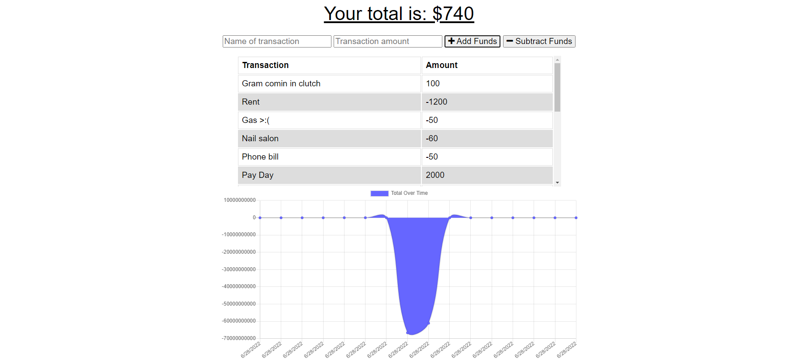

# credit-chartz!  

  ## Description 
  
  Credit Charts is a Progressive Web Application that tracks users' spending while charting their transactions. With added offline functionality, users are able to add transactions whether or not they are connected to a network!

  

  <!-- ## Usage

  Try [Credit Charts](heroku)! -->

  ## License

  Licensed under the MIT license. See [LICENSE](./LICENSE) for more information.

  ## Credits 

